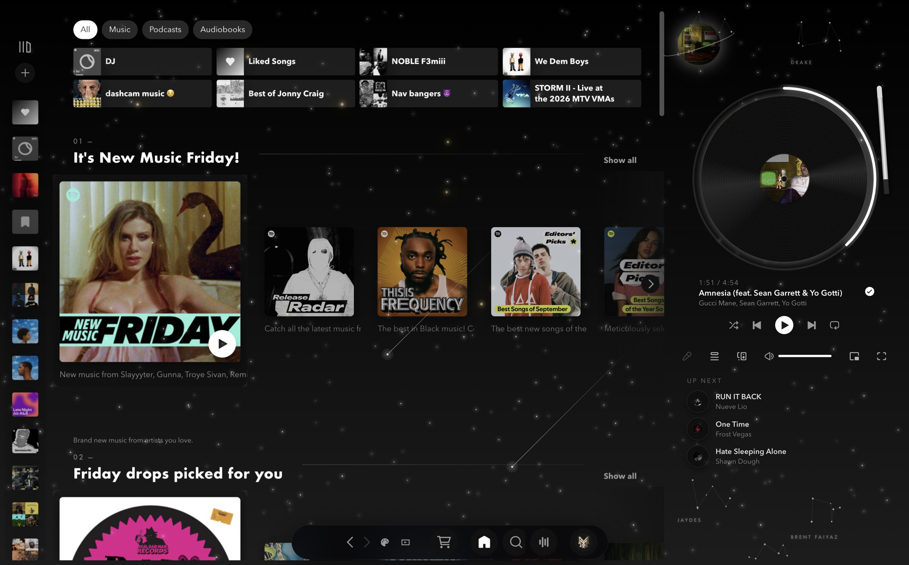
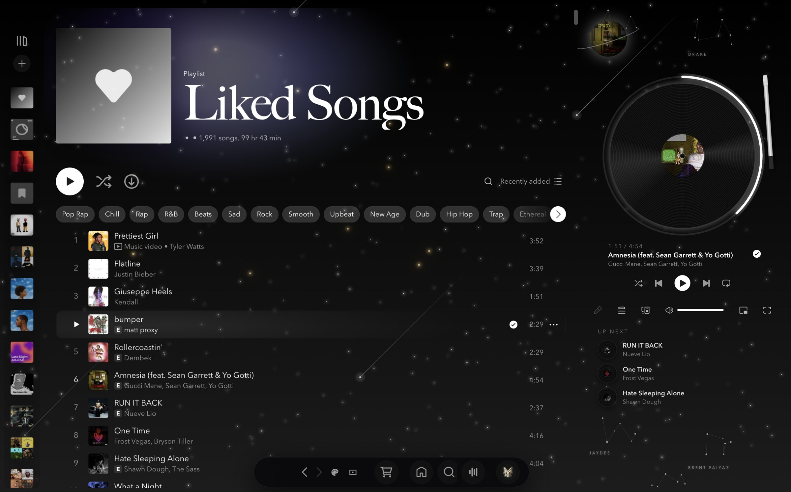
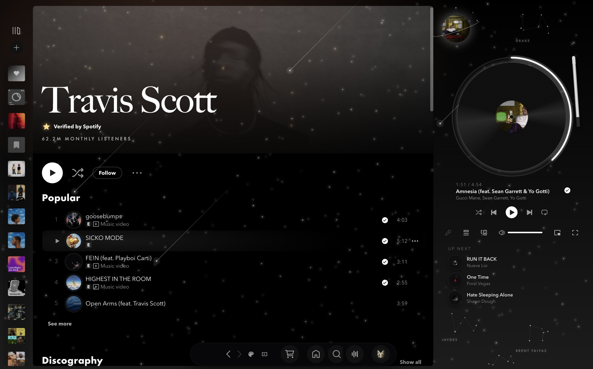
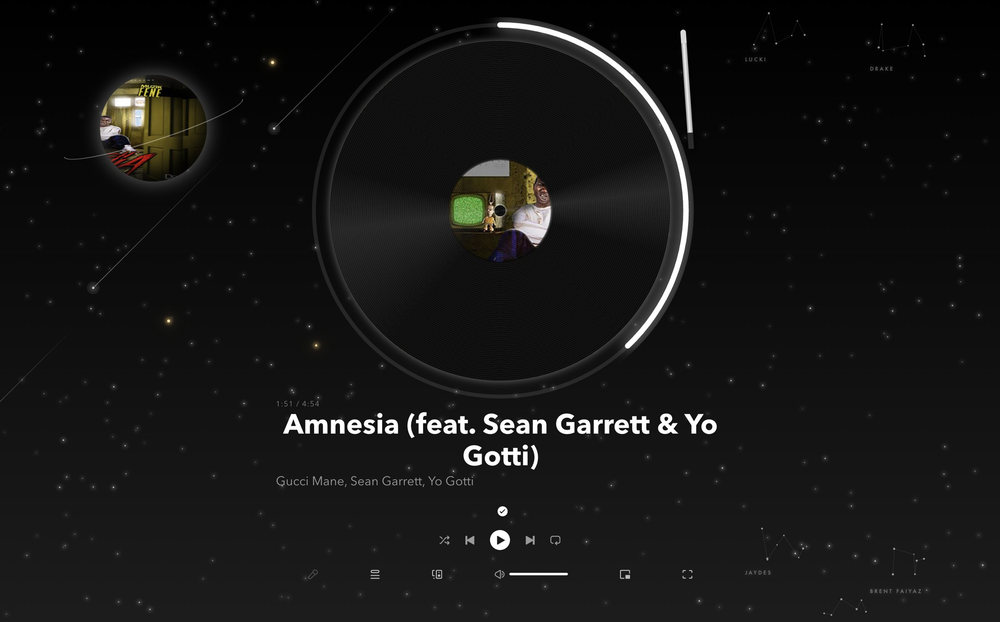
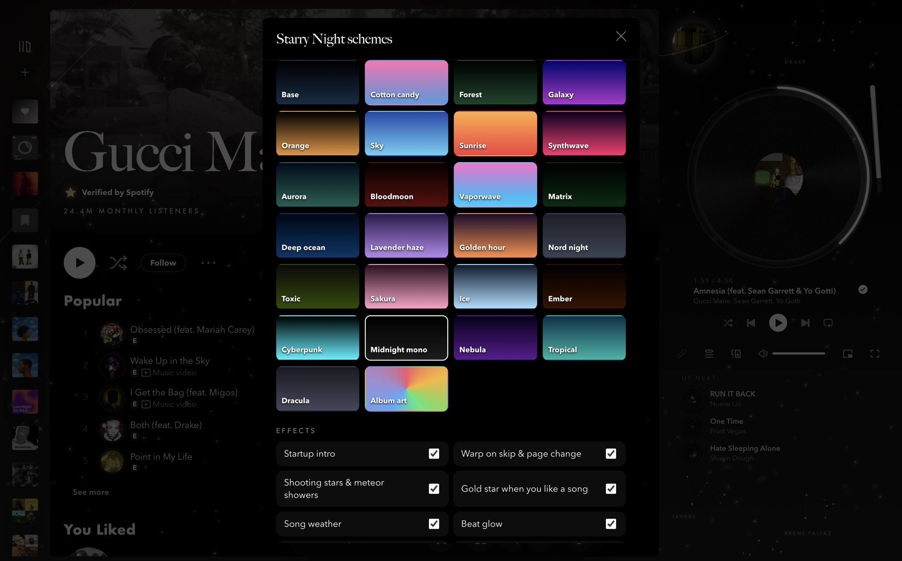
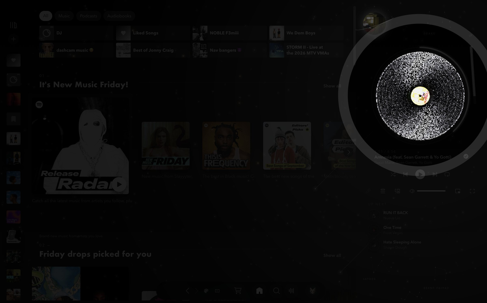
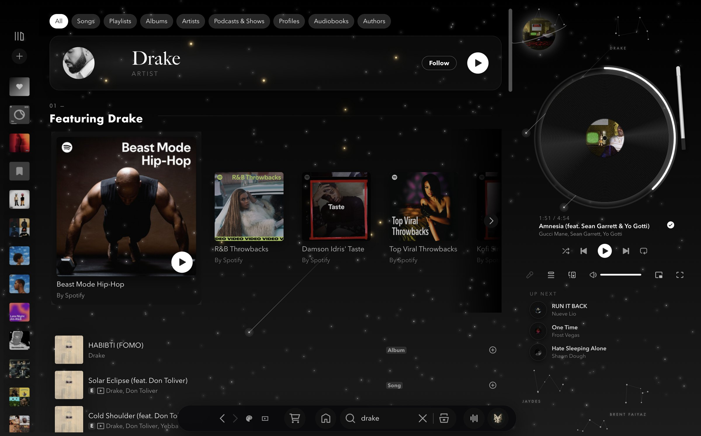
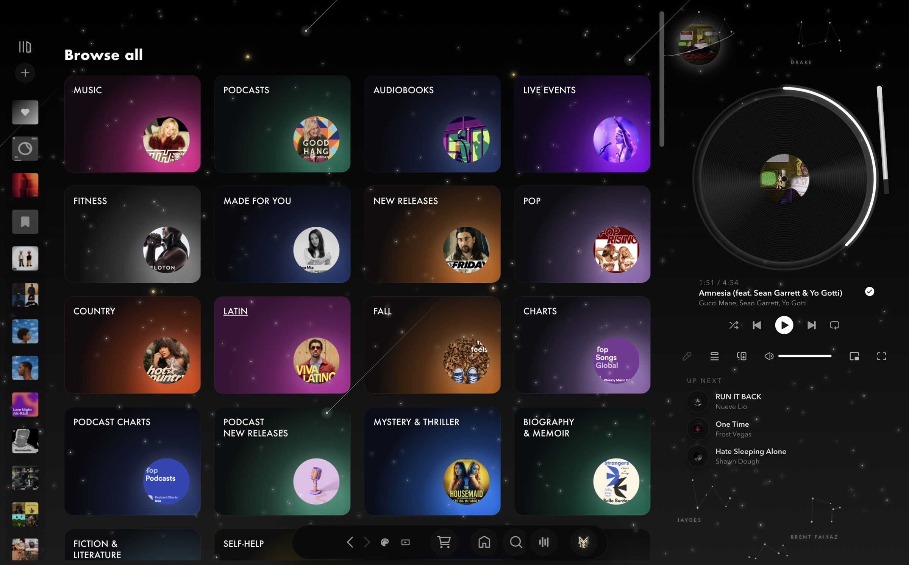
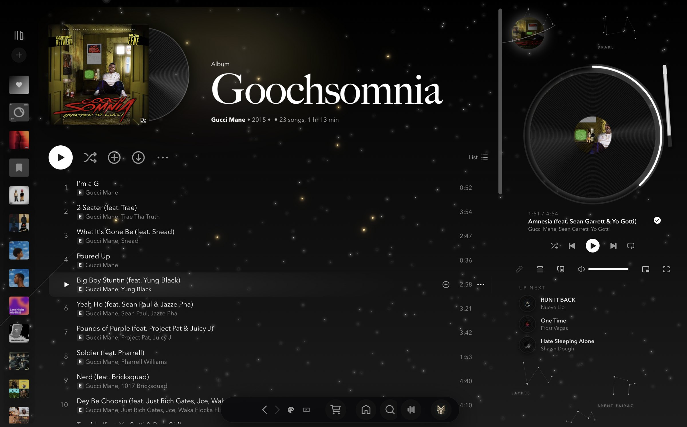
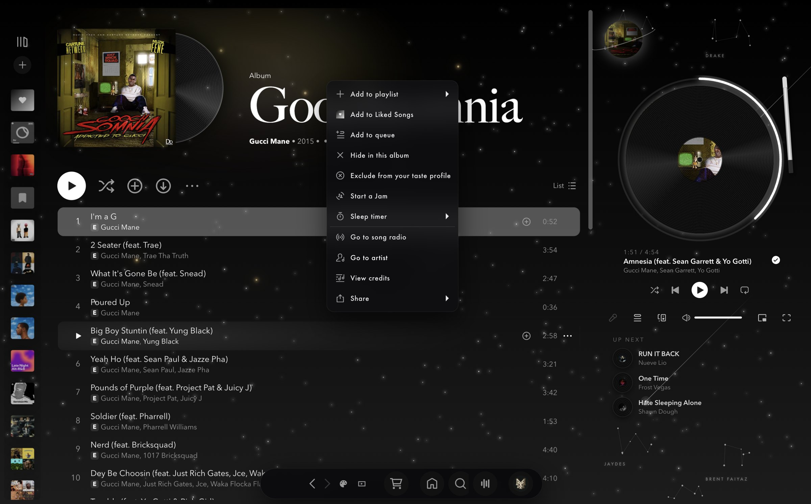

# Starry Night — a Spotify that doesn't look like Spotify

My [Spicetify](https://spicetify.app) setup: the StarryNight theme pushed until the client stops reading as Spotify.
A night sky behind everything, a spinning vinyl player, a WebGL startup intro, and effects that react to what's playing.



| | |
| --- | --- |
|  |  |
|  |  |

**Startup intro** — warp, stars converge, the record forms with a title card, then it flies into the player.

| | | |
| --- | --- | --- |
|  |  |  |

**Pages**

| | |
| --- | --- |
|  |  |
|  |  |

## What's in it

**Player**
- Vinyl record replaces the cover: the cover is the spinning centre label, with grooves, a sheen, dust and hairline scratches that catch the light.
- Tonearm drops on play and lifts on pause; the record slides out and a new one slides in on track change.
- Glow around the record pulses on every beat (Spotify's own beat data).
- Circular progress ring around the record — click it to seek. Elapsed / total time and an "up next" stack of mini records.
- Ringed planet in the corner, textured with the current cover.

**Sky**
- 25 colour schemes switchable live from the palette button, including **Album art**, which re-colours the sky from each cover.
- Warp-speed streaks on skip and page change; click empty sky for a shooting star; meteor showers when a song gets loud.
- Gold shooting star when you like a song — it stays in the sky as a permanent star.
- "Weather" from the track's tempo, loudness and key: fog, aurora, or a sky that pulses on the beat.

**Startup intro (WebGL, no libraries)** — hyperspace jump, 26k stars collapse into a tilted spinning record whose label is painted from the current cover, title card, then the record flies into the player. Press <kbd>I</kbd> to replay, click to skip.

**Interface**
- Top bar becomes a floating glass dock; Spotify green, branded chips and the Now Playing panel are gone.
- Type: Big Caslon (titles), Futura (section headings), Avenir Next (everything else) — all ship with macOS.
- Home shelves become numbered chapters with one rotating featured card; track lists lose the table look; artist pages hide clutter behind a "More" pill.
- Cinema mode (<kbd>C</kbd>): just the sky, a giant record and the title.
- Story card (<kbd>S</kbd>): saves a 1080×1920 "now playing" image to Downloads and copies it.
- Your five most-liked artists hang in the sky as constellations; the one playing lights up.
- Queue opens as a floating glass panel; settings get glass sections.
- Every effect can be switched off from the palette menu.
- Clean recording mode (<kbd>H</kbd>): hides the dock, scrollbars and your name for footage.
- Effects pause when Spotify is in the background; weather, dust and twinkle switch off on battery.

## Files

| Path | What |
| --- | --- |
| `Themes/StarryNight/user.css`, `color.ini`, `theme.js` | theme, colour schemes, star field |
| `Extensions/starry-fx.js` | player, sky effects, shelves, switches |
| `Extensions/starry-intro.js` | WebGL startup intro |
| `Extensions/theme-switcher.js` | palette menu (generated — edit `theme-switcher.template.js`, run `build-theme-switcher.py`) |
| `Extensions/visualizer-button.js`, `hide-npv.js` | visualizer button, Now Playing panel off |
| `starry-repair.sh` | re-apply after a Spotify update and check every piece landed |
| `theme-cycle.sh` | switch scheme from the terminal |

## Install

```sh
brew install spicetify-cli
git clone https://github.com/austinmax323-del/starry-night-spotify ~/.config/spicetify
# edit prefs_path in config-xpui.ini to your own Spotify prefs file
spicetify backup apply
```

After Spotify updates itself, run `~/.config/spicetify/starry-repair.sh`.

`CustomApps/marketplace` is the upstream [Spicetify Marketplace](https://github.com/spicetify/marketplace); `CustomApps/backmusic` is a third-party visualizer.
